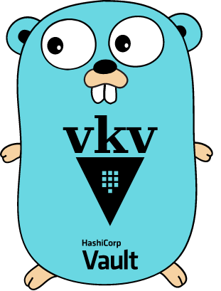

<div align="center">
<h1>vkv</h1>

<br>


`vkv` is a little CLI tool written in Go, which enables you to list, compare, import, document, backup & encrypt secrets from a [HashiCorp Vault KV engine](https://developer.hashicorp.com/vault/docs/secrets/kv):


**Checkout the [Docs](https://falcosuessgott.github.io/vkv/) to learn more about `vkv`**
</div>

## Quickstart

```bash
# Installation
version=$(curl https://api.github.com/repos/falcosuessgott/vkv/releases/latest -s | jq .name -r)
curl -OL "https://github.com/FalcoSuessgott/vkv/releases/download/${version}/vkv_$(uname)_$(uname -m).tar.gz"
tar xzf vkv_$(uname)_$(uname -m).tar.gz
chmod u+x vkv
./vkv version

# set required env vars
> export VAULT_ADDR=https://vault-server:8200
> export VAULT_TOKEN=<your-vault-token>

# verify connection
> vault status
Key             Value
---             -----
Seal Type       shamir
Initialized     true
Sealed          false
Total Shares    1
Threshold       1
Version         1.12.1
Build Date      2022-10-27T12:32:05Z
Storage Type    inmem
Cluster Name    vault-cluster-ffd05212
Cluster ID      42ef92d5-eb21-0cb5-dd0b-804dac04e505
HA Enabled      false

# list secrets recursively from a KV engine
> vkv export --path <path>
secret/ [desc=key/value secret storage] [type=kv2] # engine description & type
├── admin [v=1] [key=value] # secret version & metadata, every secret is a hyperlink o Vaults UI
│   └── sub=********
├── demo [v=1]
│   └── foo=***
└── sub
    ├── demo [v=1] 
    │   ├── demo=***********
    │   ├── password=******
    │   └── user=*****
    └── sub2
        └── demo [v=2] [admin=false key=value] 
            ├── admin=***
            ├── foo=***
            ├── password=********
            └── user=****
```