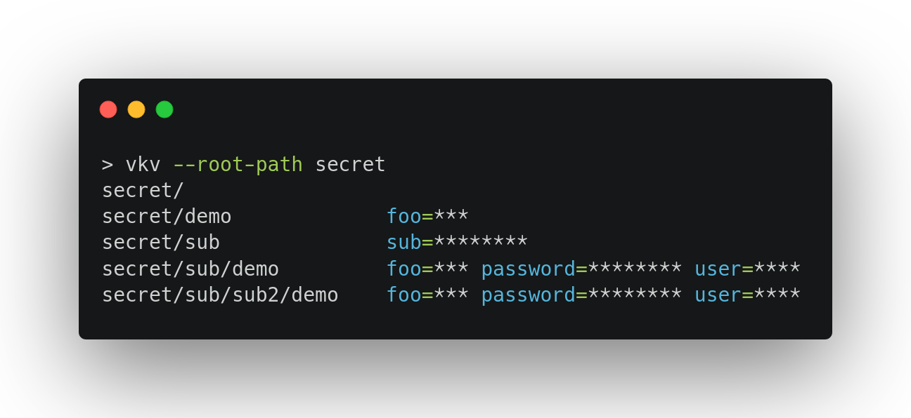

# vkv
[](https://github.com/FalcoSuessgott/vkv/actions/workflows/test.yml) [](https://github.com/FalcoSuessgott/vkv/actions/workflows/lint.yml) [](https://goreportcard.com/report/github.com/FalcoSuessgott/vkv) [](https://pkg.go.dev/github.com/FalcoSuessgott/vkv) [](https://codecov.io/gh/FalcoSuessgott/vkv)

> recursively list secrets from Vaults KV2 engine



# Installation
Find the corresponding binaries, `.rpm` and `.deb` packages in the [release](https://github.com/FalcoSuessgott/vkv/releases) section.

# Authentication
`vkv` supports token based authentication. It is clear that you can only see the secrets that are allowed by your token policy.

In order to authenticate to a Vault instance you have to export `VAULT_ADDR` and `VAULT_TOKEN`.

```bash
VAULT_ADDR="http://127.0.0.1:8200" VAULT_TOKEN="root" vkv
```

Furthermore you can export `VAULT_SKIP_VERIFY` for insecure HTTPS connection. Also `vkv` respects `HTTP_PROXY` and `HTTPS_PROXY` environment variables.

# Usage
```bash
vkv -h
recursively list secrets from Vaults KV2 engine

Usage:
  vkv [flags]

Flags:
  -h, --help               help for vkv
      --only-keys          print only keys
      --only-paths         print only paths
  -p, --root-path string   root path (default "kv2")
      --show-secrets       print out secrets
  -s, --sub-path string    sub path
  -j, --to-json            print secrets in json format
  -y, --to-yaml            print secrets in yaml format
  -v, --version            display version
```

# Walkthrough
Image we have the following KV2 structure, enabled at path `secret`:

```
secret/
secret/demo
secret/sub
secret/sub/demo
secret/sub/sub2/demo
```

## list secrets `--root-paths | -p (default kv2)`
You can list all secrets recursively by running:

```bash
vkv --root-path secret
secret/
secret/demo             foo=***
secret/sub              sub=********
secret/sub/demo         foo=*** password=******** user=****
secret/sub/sub2/demo    foo=*** password=******** user=****
```

## list only paths `--only-paths`
We can receive only the paths by running

```bash
vkv  --root-path secret --only-paths
secret/
secret/demo
secret/sub
secret/sub/demo
secret/sub/sub2/demo
```

## list only secret keys  `--only-keys`
If we want to know just the keys in every directory we can run

```bash
vkv --root-path secret --only-keys
secret/
secret/demo             foo
secret/sub              sub
secret/sub/demo         foo password user
secret/sub/sub2/demo    foo password user
```

## list from a sub directory `--sub-path | -s`
We can get the secrets of a certain sub path, by running

```bash
vkv  --root-path secret --sub-path sub --only-keys
secret/sub/
secret/sub/demo         foo password user
secret/sub/sub2/demo    foo password user
```

## show secrets  `--show-secrets`
Per default secret values are masked. Using `--show-secrets` shows the secrets. **Use with Caution**

We can get the secrets of a certain sub path, by running

```bash
vkv --root-path secret --show-secrets
secret/
secret/demo             foo=bar
secret/sub              sub=password
secret/sub/demo         foo=bar password=password user=user
secret/sub/sub2/demo    foo=bar password=password user=user
```

## export to json `--to-json | -j`
You can combine all flags and export the result to json by running:

```bash
vkv --root-path secret --sub-path sub --show-secrets --to-json | jq .
```

```json
{
  "secret/sub/demo": {
    "foo": "bar",
    "password": "password",
    "user": "user"
  },
  "secret/sub/sub2/demo": {
    "foo": "bar",
    "password": "password",
    "user": "user"
  }
}
```

## export to yaml  `--to-yaml | -y`
Same applies for yaml:

```bash
vkv --root-path secret --sub-path sub --show-secrets --to-yaml
```

```yaml
secret/sub/demo:
  foo: bar
  password: password
  user: user
secret/sub/sub2/demo:
  foo: bar
  password: password
  user: user
```