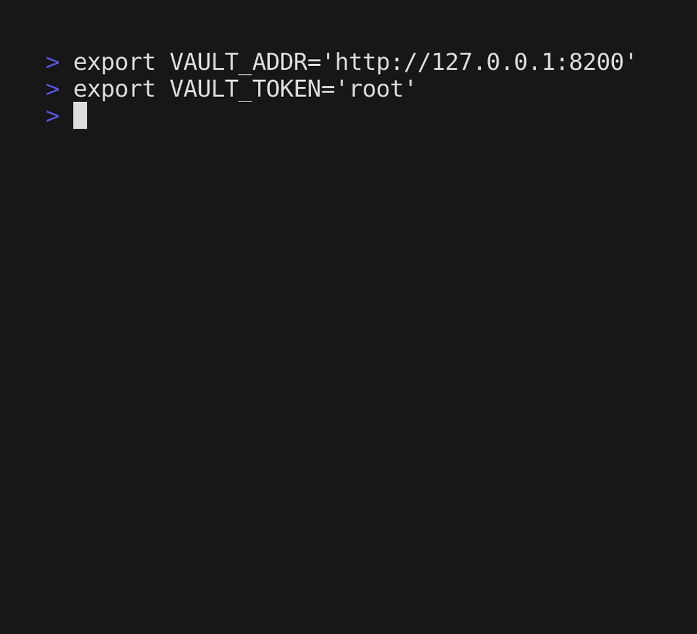
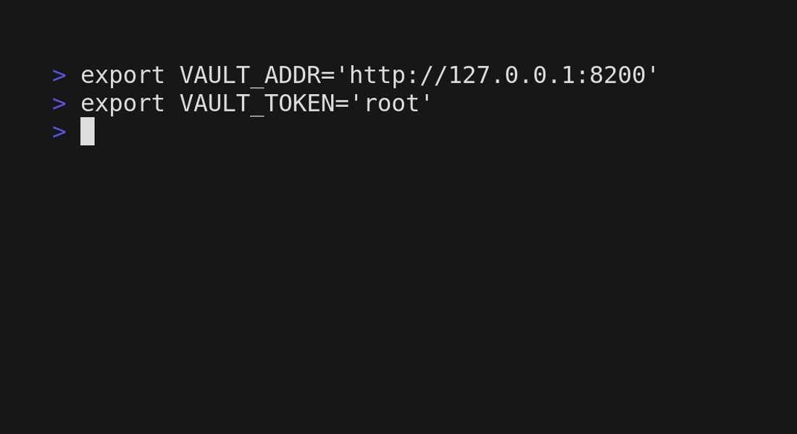
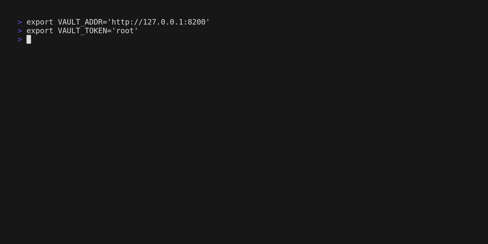

# vkv [](https://github.com/FalcoSuessgott/vkv/actions/workflows/test.yml) [](https://github.com/FalcoSuessgott/vkv/actions/workflows/lint.yml) [](https://goreportcard.com/report/github.com/FalcoSuessgott/vkv) [](https://codecov.io/gh/FalcoSuessgott/vkv) [](https://GitHub.com/FalcoSuessgott/vkv/releases/)

`vkv` is a highly tested, little CLI tool written in Go, which lets you export and import 
secrets from a [HashiCorp Vault KV-v2 engine](https://developer.hashicorp.com/vault/docs/secrets/kv/kv-v2):


# Description
`vkv` allows you to recursively list secrets from any KV-v2 engine in various useful [output formats](https://github.com/FalcoSuessgott/vkv#output-formats). 

Meanwhile `vkv import` takes `vkv`'s `JSON` or `YAML` output and writes its secrets to the specified KV-v2 engine. You can even specify single directories into already existing secret engines.

Checkout the [Advanced Examples](https://github.com/FalcoSuessgott/vkv#advanced-examples) section to learn more handy `vkv` snippets.

# Installation

## Using `go`
```bash
go install github.com/FalcoSuessgott/vkv@latest
```

## From Sources
```bash
git clone https://github.com/FalcoSuessgott/vkv
cd vkv
go install 
```

## Packages
`vkv` has RPM, DEB packages and Windows Binaries in the [release](https://github.com/FalcoSuessgott/vkv/releases) section.

# Supported Vault Versions
`vkv` is being tested on `Windows`, `MacOS` and `Linux` and against [**Vaults last 3 major versions**](https://github.com/FalcoSuessgott/vkv/blob/master/.github/workflows/test.yml#L14), with version `v1.8.0` being the first tested one, but it may work with earlier releases.


# Authentication
`vkv` supports all of Vaults [environment variables](https://www.vaultproject.io/docs/commands#environment-variables). In order to authenticate you will have to set at least `VAULT_ADDR` and `VAULT_TOKEN`.

⚠️ **Your token policy requires `read` and `list` capabilities on every path of the specified secret engine, otherwise `vkv` errors with `403`. This behaviour is likely to change in future releases.**

# Usage
## Export
`vkv` flags can be divided into input, modifying and output format flags.

## Input flags
| Flag                  | Description                                                                       | Env                    | Default |
|-----------------------|-----------------------------------------------------------------------------------|------------------------|---------|
| `-p`, `--path`        | KVv2 Engine path                                                                  | `VKV_PATH`             |         |
| `-e`, `--engine-path` | This flag is only required if your kv-engine contains a `/`, <br/> which is used by vkv internally for splitting the secret paths, `vkv` will then append the values of the path-flag to the engine path, if specified (`<engine-path>/<path>`)| `VKV_ENGINE_PATH`      |       |


## Modifying flags
| Flag                  | Description                                                                       | Env                    | Default |
|-----------------------|-----------------------------------------------------------------------------------|------------------------|---------|
| `--only-keys`         | show only keys                                                                    | `VKV_ONLY_KEYS`        | `false` |
| `--only-paths`        | show only paths                                                                   | `VKV_ONLY_PATHS`       | `false` |
| `--show-values`       | don't mask values                                                                 | `VKV_SHOW_VALUES`      | `false` |
| `--max-value-length`  | maximum char length of values (set to `-1` for disabling)                         | `VKV_MAX_VALUE_LENGTH` | `12`    |
| `--template-file`     | path to a file containing Go-template syntax to render the KV entries             | `VKV_TEMPLATE_FILE`    |         |
| `--template-string`   | string containing Go-template syntax to render KV entries                         | `VKV_TEMPLATE_STRING`  |         |

## [Output flags](https://github.com/FalcoSuessgott/vkv#output-formats)
| Flag                  | Description                                                                       | Env                    | Default |
|-----------------------|-----------------------------------------------------------------------------------|------------------------|---------|
| `-f`, `--format`      | output format (options: `base`, `yaml`, `policy`, `json`, `export`, `markdown`, `template`) | `VKV_FORMAT` | `base`  |

⚠️ **A flag always precede its environment variable**

You can combine most of those flags in order to receive the desired output.

## Import 
Using `vkv import -`, tells `vkv` do read data via STDIN. The idea of `vkv import -` is, in order to copy/mirror KV-v2 secrets or complete engines across diferrent Vault Servers or Namespaces, you can simply pipe 
`vkv`s output into the `vkv import` command:

```bash
 # dont forget to use --show-values, otherwise the secrets will be uploaded masked.
vkv -p <source> --show-values -f=yaml | vkv import - -p <destination>
```

### A few notes:
* `<source>` and `<destinations>` dont have to be the root path of a secret engine, you also specify subpaths and copy them another secret engine.
* `vkv` will error if the enabled secret engine already exist, you can use `--force` to overwrite the destination engine, if the destination path contains a subpath (`root/sub`), `vkv` will then insert the secrets to that specific directory

**⚠️ `vkv import` can overwrite important secrets, always double check the commmand by using the dry-run mode (`--dry-run`) first**

## Input flags
| Flag                  | Description                                                                       | Env                    | Default |
|-----------------------|-----------------------------------------------------------------------------------|------------------------|---------|
| `-p`, `--path`        | Destination KV-v2 path                                                            | `VKV_IMPORT_PATH`      |         |
| `-f`, `--file`        | path to a file containing vkv JSON or YAML output                                 | `VKV_IMPORT_FILE`      |         |
| `-d`, `--dry-run`     | Dry-run does not upload any secrets and just prints a preview                     | `VKV_IMPORT_DRY_RUN`   |         |
| `-s`, `--silent`      | do not show the resulting secret engine                                           | `VKV_IMPORT_SILENT`    | `false` |
| `--force`             | force overwrites the specified secret engine. **Use with Caution**                | `VKV_IMPORT_FORCE`     | `false` |
| `---max-value-length` | maximum char length of values (set to `-1` for disabling)                         | `VKV_IMPORT_MAX_VALUE_LENGTH` | `12`    | 
| `--show-values`       | dont mask values when printing the resulting secret engine                        | `VKV_IMPORT_SHOW_VALUES`| `false`|

⚠️ **A flag always precede its environment variable**


# Export Output Formats
`vkv` supports various output formats, such as `yaml` and `json` (which are self-explanatory). Furthermore you can also display KV-secrets recursively as:

### Base
> prints the secrets in a handy tree-view.


### Policy
> prints the capabilities of the authenticated Vault token in a matrix for each path.


### Markdown Table
> prints the secrets in a Markdown table for documenting the structure.


### Export
> prints secrets in `export <KEY>=<VALUE>`. Use `eval` for loading `vkv` output in your shell.


### Template
> Use custom templates for processing the secrets. (Also see [Advanced Examples](https://github.com/FalcoSuessgott/vkv#generate-vault-policies)).


# Advanced Examples
### Compare KV-Engines and highlight the difference using `diff` 
`vkv` can be used to compare secrets across Vault servers or KV engines.

Here is an example using `diff`, the `|` indicates the changed entry per line:



### Generate Vault policies using the `template` output format
`vkv` can be used to generate policies from an existing KV path. 
When using the template output format, all the data is passed to STDOUT as a 

```go
map[string][]entry
```

where `entry` is a struct of 

```go
type entry struct {
  Key   string
  Value interface{}
}
```

Which means you can iterate over the map, where the map-key is the secret path and iterate again over the slice of entries in order to access the key and value of the secret (also see [assets/template.tmpl](assets/template.tmpl)).

Knowing this, one can generate Vault policies from an existing KV-engine using the following Go-Template-Snippet:

```go
{{ range $path, $data := . }}
path "{{ $path }}/*" {
    capabilities = [ "create", "read" ]
}
{{ end }}
```

results in:


### Iterate over all KV-engines and display their secrets the using `fzf` and `jq`
using `vault secrets list` and a little bit of `jq`-logic (see [assets/fzf.sh](assets/fzf.sh)) we can get a list of all KV-engines visible for the token. If we pipe this into `fzf` we can get a handy little  preview-app:


# Development
Clone this repository and run:

```sh
make bootstrap
```

in order to have all used build dependencies

You can spin up a development vault for local testing by running:

```sh
make vault
```

The following environment variables are required:

```sh
export VAULT_ADDR="http://127.0.0.1:8200"
export VAULT_TOKEN="root"
export VKV_PATH="secret"
```

If everything worked fine, you should be able to run:

```sh
go run main.go   
secret/
├── demo
│   └── foo=***
├── sub
│   └── sub=********
├── sub/
│   └── demo
│       ├── demo=***********
│       ├── password=******
│       └── user=*****
└── sub/
    └── sub2/
        └── demo
            ├── password=*******
            ├── user=********
            └── value=*********
```

