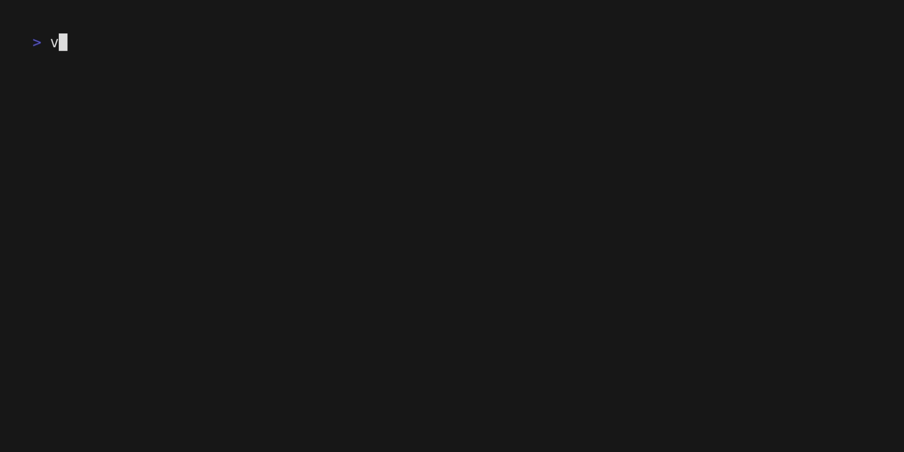

<div align="center">
  <h1> vkv </h1>
  

  [](https://github.com/FalcoSuessgott/vkv/actions/workflows/test.yml) [](https://github.com/FalcoSuessgott/vkv/actions/workflows/lint.yml) [](https://goreportcard.com/report/github.com/FalcoSuessgott/vkv) [](https://codecov.io/gh/FalcoSuessgott/vkv)
  [](https://GitHub.com/FalcoSuessgott/vkv/releases/)
</div>

---

# Description
`vkv` recursively list you all key-value entries from Vaults KV2 secret engine in various formats. `vkv` flags can be divided into input, modifying and output format flags.

So far `vkv` offers:

## Input flags
| Flag                  | Description                                                                       | Env Var                | Default |
|-----------------------|-----------------------------------------------------------------------------------|------------------------|---------|
| `-p`, `--path`        | KVv2 Engine path (env var: VKV_PATH)                                              | `VKV_PATH`             |       |
| `-e`, `--engine-path` | Specify the engine path. This flag is only required in case your kv-engine contains special characters such as a `/`. <br/> `vkv` will then append the values of the path-flag to the engine path, if specified (`<engine-path>/<path>`)| `VKV_ENGINE_PATH`      |       |


## Modifying flags
| Flag                  | Description                                                                       | Env Var                | Default |
|-----------------------|-----------------------------------------------------------------------------------|------------------------|---------|
| `--only-keys`         | show only keys                                                                    | `VKV_ONLY_KEYS`        | `false` |
| `--only-paths`        | show only paths                                                                   | `VKV_ONLY_PATHS`       | `false` |
| `--show-values`       | don't mask values                                                                  | `VKV_SHOW_VALUES`      | `false` |
| `--max-value-length`  | maximum char length of values (set to `-1` for disabling)                         | `VKV_MAX_VALUE_LENGTH` | `12`    |
| `--template-file`     | path to a file containing Go-template syntax to render the KV entries             | `VKV_TEMPLATE_FILE`    |         |
| `--template-string`   | string containing Go-template syntax to render KV entries                         | `VKV_TEMPLATE_STRING`  |         |

## [Output flags](https://github.com/FalcoSuessgott/vkv#output-formats)
| Flag                  | Description                                                                       | Env Var                | Default |
|-----------------------|-----------------------------------------------------------------------------------|------------------------|---------|
| `-f`, `--format`      | output format (options: `base`, `yaml`, `json`, `export`, `markdown`, `template`) | `VKV_FORMAT`           | `base`  |

⚠️ **A flag always precede its environment variable**

You can combine most of those flags in order to receive the desired output.

# Installation
Find the corresponding binaries, `.rpm` and `.deb` packages in the [release](https://github.com/FalcoSuessgott/vkv/releases) section.

# Supported OS and Vault Versions
`vkv` is being tested on `Windows`, `MacOS` and `Linux` and also against Vault Version >= `v1.8.0` (but it also may work with lower versions).

# Authentication
`vkv` supports token based authentication. It is clear that you can only see the secrets that are allowed by your token policy.

All of vaults [environment variables](https://www.vaultproject.io/docs/commands#environment-variables) are supported. In order to authenticate to a Vault instance you have to set at least `VAULT_ADDR` and `VAULT_TOKEN`.

---

# Output Formats
<div align="center">
  <h2> Base </h2>
  

  <h2> YAML </h2>
  

  <h2> JSON </h2>
  

  <h2> Markdown </h2>
  

  <h2> Export </h2>
  

  <h2> Template </h2>
  
</div>

# Advances Examples
## Compare KV-Engines and get the diff 
`vkv` can be used to compare secrets across Vault servers or KV engines.

Here is an example using `diff`, the `|` indicates the changed entry per line:


## Generate Vault policies
`vkv` can be used to generate policies from an existing KV path. 
When using the template output format, all the data is passed to STDOUT as a 

```go
map[string][]entry
```

where `entry` is a struct of 

```go
type entry struct {
  Key   string
  Value interface{}
}
```

Which means you can iterate over the map, where the map-key is the secret path and iterate again over the slice of entries in order to access the key and value of the secret (also see [assets/template.tmpl](assets/template.tmpl)).

Knowing this, one can generate Vault policies from an existing KV-engine using the following Go-Template-Snippet:

```go
{{ range $path, $data := . }}
path "{{ $path }}/*" {
    capabilities = [ "create", "read" ]
}
{{ end }}
```

results in:


## Iterate over all KV-engines and display their secrets the using `fzf` and `jq`
using `vault secrets list` and a little bit of `jq`-logic (see [assets/fzf.sh](assets/fzf.sh)) we can get a list of all KV-engines visible for the token. If we pipe this into `fzf` we can get a handy little  preview-app:




# Development
Clone this repository and run:

```sh
make bootstrap
```

in order to have all used build dependencies

You can spin up a development vault for local testing by running:

```sh
make vault
```

The following environment variables are required:

```sh
export VAULT_ADDR="http://127.0.0.1:8200"
export VAULT_TOKEN="root"
export VKV_PATH="secret"
```

If everything worked fine, you should be able to run:

```sh
go run main.go   
secret/
├── demo
│   └── foo=***
├── sub
│   └── sub=********
├── sub/
│   └── demo
│       ├── demo=***********
│       ├── password=******
│       └── user=*****
└── sub/
    └── sub2/
        └── demo
            ├── password=*******
            ├── user=********
            └── value=*********
```

